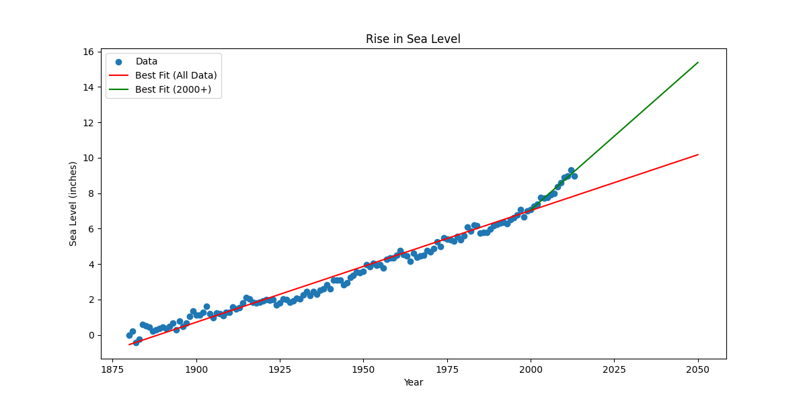

## 📊 Project Preview

### Sea Level Prediction Visualization



# 🌊 Sea Level Predictor

This project analyzes global average sea level change since **1880** and predicts future sea level rise up to the year **2050** using linear regression.

It is part of the **freeCodeCamp Data Analysis with Python Certification**.

---

## 📊 Project Overview

The goal of this project is to:
- Analyze historical sea level data
- Visualize trends using scatter plots
- Fit regression lines to predict future sea level rise
- Compare long-term trend vs recent trend (2000 onwards)

---

## 📁 Dataset

The dataset used:

📌 `epa-sea-level.csv`

It contains:
- `Year` — the year of measurement
- `CSIRO Adjusted Sea Level` — measured sea level in inches

Source:  
US Environmental Protection Agency (EPA)

---

## 🛠️ Tools Used

- Python 🐍
- Pandas 📊
- Matplotlib 📈
- SciPy (linregress) 📉
- OS module 📁

---

## 📂 Project Structure

```text
Sea Level Predictor/
│
├── docs/
│   └── sea_level_plot.png
│
├── epa-sea-level.csv
├── sea_level_predictor.py
├── main.py
├── test_module.py
└── README.md
```
---

## 📈 Features
1. Scatter Plot
Shows historical sea level data from 1880 onwards
2. Line of Best Fit (All Data)
Regression line using all available data
Extended prediction up to 2050
3. Line of Best Fit (2000+ Data)
Regression line using only data from year 2000 onward
Shows recent trend and prediction to 2050

---

## 💾 Output

All generated visualizations are saved in:
```
/docs/sea_level_plot.png
```
## ▶️ How to Run
1. Install dependencies
```
pip install pandas matplotlib scipy
```
2. Run the project
```
python main.py
```
---
## 🧪 Run Tests

To verify the project functions correctly:
```
python -m unittest test_module.py
```
Expected output:
```
OK
```
---
## 📊 Key Insight

This project shows that:

Sea level is steadily rising over time 🌍
Recent data (since 2000) shows a faster increase
If trends continue, sea levels will keep rising significantly by 2050
---

## 👨‍💻 Author

### **Andy Razon**
🌐 Portfolio: https://andyrazon.website

📜 License
This project is part of the freeCodeCamp curriculum and is intended for educational purposes.
